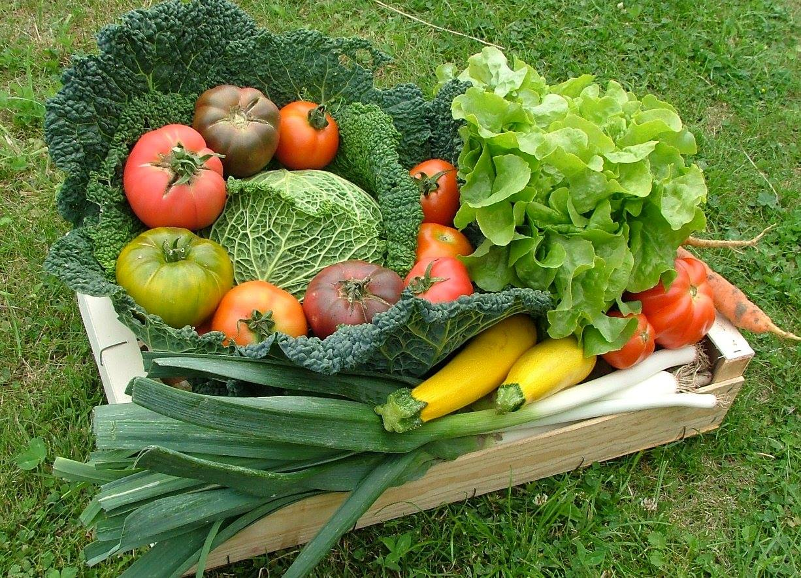

    title: Semaine sans pesticide
    ---
    
Le **samedi 26 mars**, le Réseau des Amap de Haute-Normandie, le groupe local de Rouen de Greenpeace et Alternatiba Rouen seront présents à Rouen pour informer sur les pesticides et participeront ensemble à cet évènement.

Des dégustations de produits bio et locaux, des animations accompagneront la distribution des documents et l’information aux passants sur les dangers des pesticides et leurs alternatives.

Nous vous donnons rendez-vous à l'angle de la rue St Lo et de la rue Socrate (entre le  lycée Camille St Saens et l'espace du palais) à partir de 14 h 30.

    

    