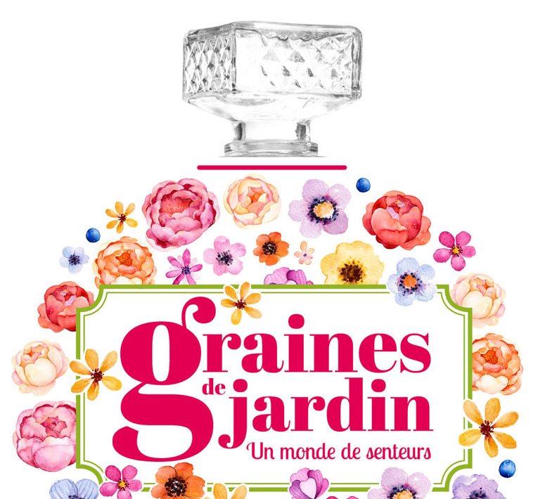

    title: Graines de jardin
    date: 05-05-2017
    cover: 2017-05-05_graines-de-jardin-couverture.jpg
    excerpt: **Le week-end du 20 au 21 mai de 10h à 19h**, venez découvir « *un monde de senteurs* » le thème du festival « *Graines de jardin* » à Rouen.
    featured: true
---

**Le week-end du 20 au 21 mai de 10h à 19h**, venez découvir « *un monde de senteurs* » le thème du festival « *Graines de jardin* » à Rouen.

« *Graines de jardin* » est un festival dédié au jardinage et à l'écologie. Ayant pour thème cette année « *un monde de senteurs* ». Des stands de [producteurs vendant en AMAP](http://reseau-amap-hn.com/les-producteurs-en-amap) et le stand du Réseau régional des AMAPHN (stand 23) vous proposerons animations et dégutations.

 - Entrée libre
 - Plus d'informations sur <http://www.graines-de-jardin.fr>
 
 
     Title: Noël en cuisine avec les AMAP ! 
    Date: 2016/12/15
    Author: Le Réseau des AMAP de Haute&#x2011;Normandie
    Cover: cuisine-gargan.jpg
    Excerpt: Lundi 19 décembre : Le Réseau des Amap et l’Amap du Mt Gargan vous donnent rendez-vous à 18 h pour un atelier cuisine à partir du contenu d’un panier de légumes de saison.
    featured: