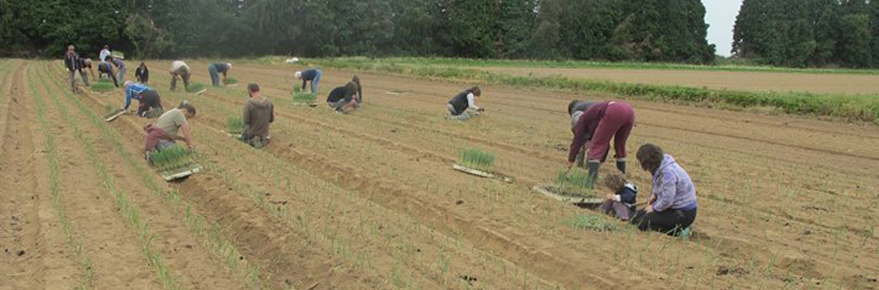

    title: Graine en main
    date: 04-07-2017
    cover: 2017-07-04_graine-en-main.jpg
    excerpt: **bientôt un jardin d'insertion à Etainhus**, initié par les «*amap de la pointe de caux*» !
    featured: true
---

**L'association Graine en main** va bientôt commencer un jardin d'insertion à Etainhus, une reprise d'exploitation initiée par les amap de la pointe de caux qui se sont regroupées pour permettre à la fois une continuité d'approvisionnement aux amap, et aussi faire de l'insertion. L'idée a germé (!) il y a un an quand le maraicher a souhaité revendre son exploitation, craignant ne plus avoir de bons légumes bio dans leur panier, ils se sont montés en association : Graine en main.

Nous vous tiendrons informé de l'évolution de ce beau projet.

Plus d'information sur [la page de Graine en main](https://www.facebook.com/GraineEnMain/) 
