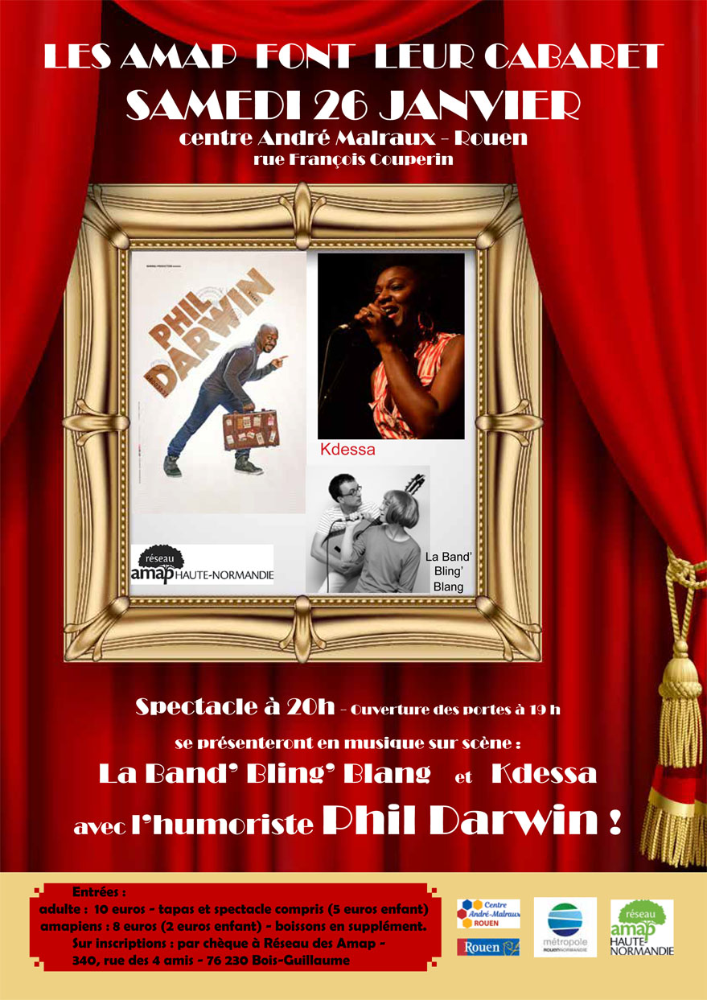

   
**samedi 26 janvier : dès 19  h «Les Amap font leur cabaret»** 
buffet dégustation avec une entrée pour le cabaret, deux  chanteuses Kdessa et la Band Bling Blang et un humoriste Phil Darwin tiendront la scène jusqu'à 23 h. Ouverture des portes à 19 h début du spectacle à 20 h. Les inscriptions et paiements se font à l’avance par chèque auprès du réseau. Utilité de prendre ses places à l’avance car cela risque de partir vite...

Des ateliers cuisine et d'autres animations précederont l'évènements, nous vous tiendrons au courant.

Entrée : 10e pour les adultes, et 5 e pour les enfants - tarif réduit 8 e pour amapiens, 2e pour les enfants. Boissons en supplément buvette : Fasodie et Artisans du Monde. Chèque à envoyer avec le nom de votre Amap, vos coordonnées tél et mail,  le nombre de place enfants, adultes  à Réseau des Amap - 340 , rue des 4 amis - 76 230 Bois-Guillaume; les billets seront à retirés sur place le jour J. Une vente de billet aura lieu aussi la veille vendredi 25 janvier de 17 h à 19 h centre andré malraux.
Lieu : centre Malraux, rue Françoius Couperin - La Grand Mare - Rouen

