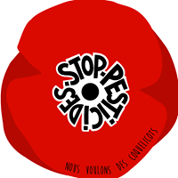

---
# Nous voulons des Coquelicots

Depuis la rentrée, l'appel "Nous voulons des coquelicots" réunit chaque premier vendredi du mois, les citoyen-ne-s demandant résolument l'interdiction de l'utilisation des pesticides de synthèse dans tous les secteurs agricoles.

Les mobilisations s'effectuent devant les mairies de nombreuses villes et villages - plus de 500 à ce jour - regroupant de nombr-ses-eux participant-e-s sensibles aux indiscutables atteintes à la biodiversité et aux risques sanitaires inacceptables générés par ces produits dans l'ensemble de la chaine alimentaire.

Le [Réseau des AMAP de Haute Normandie](www.reseau-amap-hn.com/amap),  les AMAPien-nes et productrice-eur-s de ses plus de soixante AMAP réparties dans la région s'associent naturellement à ces initiatives, et y apportent leurs contributions en participant aux animations proposées dont l'approvisionnement de "disco-soupes".
