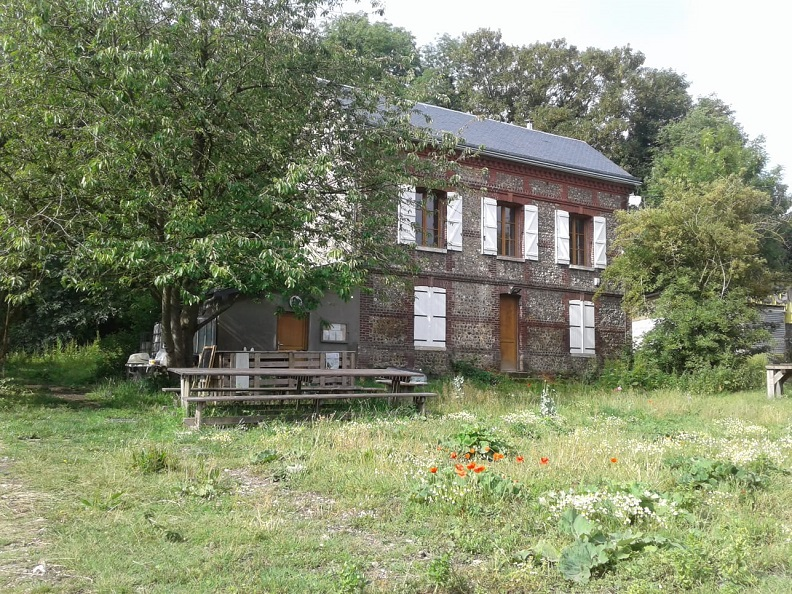

    title: Un nouveau local pour le réseau des AMAP
    cover: maisonnette-de-repainville-couverture.jpg
    excerpt: Nouveau siège socual pour le réseau régional des AMAP Haut Normand
    featured: true
---

Le siège social du [réseau des AMAP Haut Normand](http://reseau-amap-hn.com) est installé au Parc Urbain Naturel de Repainville au 3B Route de Lyons à Rouen. 

Besoin d'infos, de conseils, de documents? Nous vous accueillons, sans rendez-vous, tous les mercredis de 14h à 18h. 

**Réseau des AMAP Haut Normand**  
Parc Naturel Urbain de Repainville - 3b route de Lyons-la-Forêt - 76000 Rouen  
07 68 98 17 89  
contact@reseau-amap-hn.com  
http://www.reseau-amap-hn.com  
http://www.facebook.com/reseau.amap.hautnormand  
